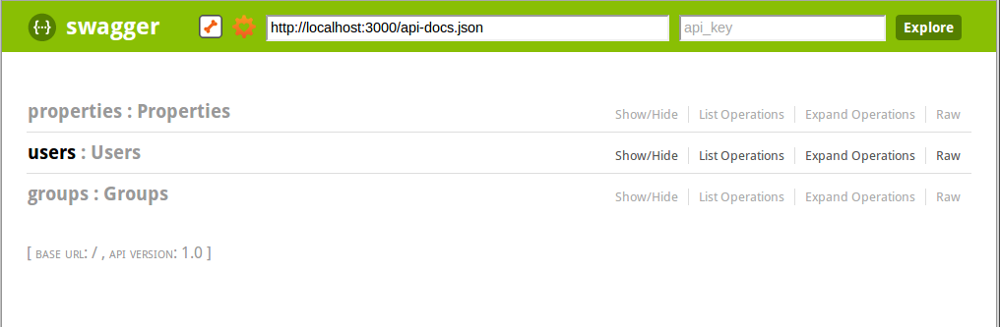
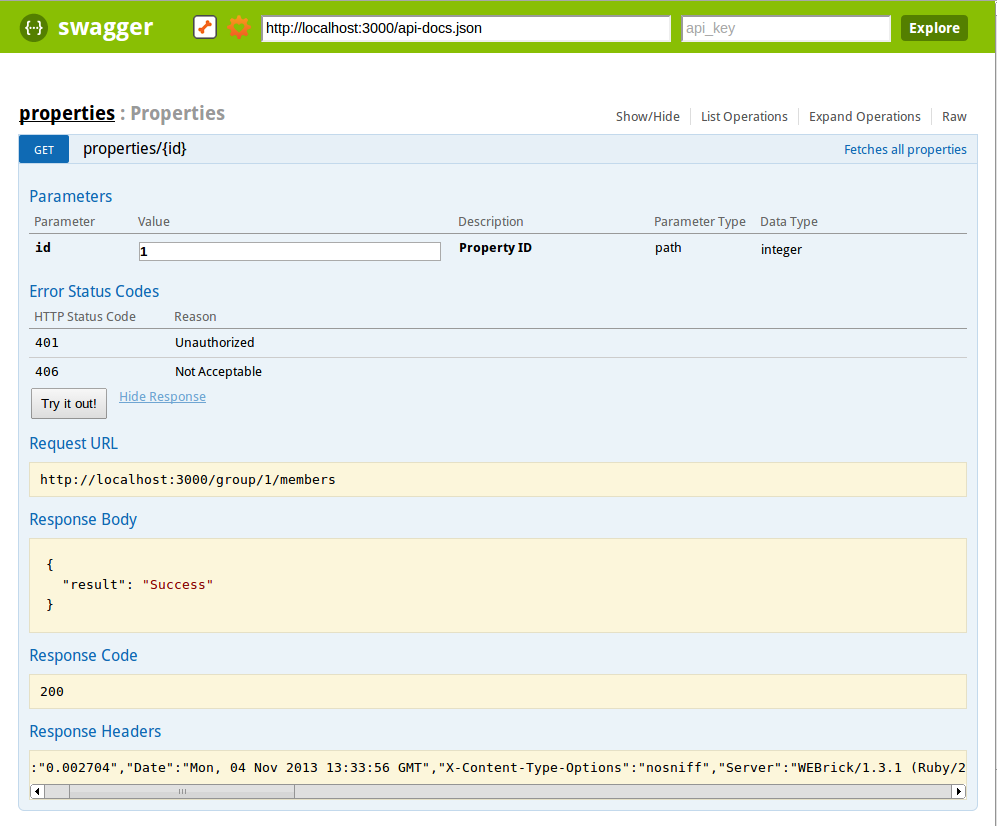

# swagger-docs-sample
##Sample Rails application for swagger-docs

```bash
bundle
rake swagger:docs
rails server
```

This is a sample rails application that demonstrates the swagger-docs rake
task and it's output.

This sample app has some sample JSON controllers which contain swagger_controller
directives in them - e.g.

```ruby
class PropertiesController < ApplicationController

  swagger_controller :properties, "Properties"

  swagger_api :show do
    summary "Fetches all properties"
    param :path, :id, :integer, :required, "Property ID"
    response :unauthorized
    response :not_acceptable
  end

  def show
    render :json => {result:"Success"}, :status => 200
  end

end
```

The swagger-docs rake task (rake swagger:docs) then examines 
your controllers to determine which controllers should be documented for swagger-ui.

Swagger-ui is included in the project (with some minor tweaks to its files for its path location).
Once you have fired up your rails server for this sample application point your browser to:

http://localhost:3000/api

You should then see the swagger-ui API homepage for this sample application
where you can then see the documentation that has been generated and interact
with the dummy controllers - as shown below:

## swagger-docs -> swagger-ui screenshots





## More information

For more information about swagger-docs visit the project home page:

https://github.com/richhollis/swagger-docs
